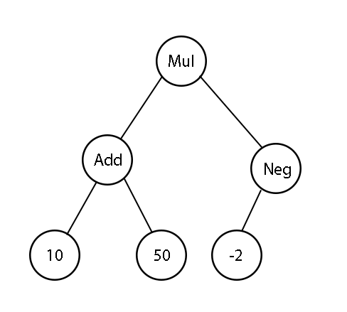

# Calculator
## Misc - 50pts (83 solves)

>Calculator is a nice invention

# Solution

Connecting to the remote server gives us the following:
```How fast are you on calculating basic math expression?
Answer 100 math questions in 30 seconds to the flag

Operations include: 
1. add x y -> returns x + y
2. mul x y -> returns x * y
3. sub x y -> returns x - y
4. neg x -> returns -x
5. inc x -> returns x + 1

Example1: mul add 1 2 sub 5 1
Ans1: (1 + 2) * (5 - 1) = 12

Example2: add mul sub 3 2 inc 5 3
Ans2: (3 - 2) * (5 + 1) + 3 = 9
```

This indicates that will be using a prefix notation to calculate the equations.

While there are prefix calculators code out on stackoverflow I've opted to challenge myself to write the algorithm from scratch.

## Algorithm

In this algorithm, we will basically traverse a some sort of an expression tree recursively as we read each operation/number left to right.

"add", "sub", and "mul" can be treated as nodes that branches into 2 other nodes left and right.

"inc", and "neg" can be treated as nodes that branch only to the left.

Each node ends when it containes a number.

# Sample problem

```mul add 10 50 neg -2```

Given the problem above, we can visualise it as the following expression tree:



- Starting with mul, we will create a leftwards branch containing the next operation/number and move down that branch.
- Since the next operation is "add", we create another branch leftwards as well.
- Now since the next node contains a number (10), we stop creating any new branches and return to the previous node.
- Now we create a right branch in the "add" node containing the next value and move down that branch.
- Similarly, we encounter a number (50) and return back to the previous node.
- The "add" node now has 2 numbers which causes it to return the sum (60) of both numbers back to the "mul" node.
- "Mul" node creates a rightwards branch containing "neg"
- "Neg" creates a leftward branch containing -2
- The node containing -2 returns itself to the previous node
- "Neg" now has a number and returns the negative of that number (2) to "mul"
- "Mul" sums the 2 numbers and returns the final result. (120)

We now can create a recursive function that does all of the above for us.

``` python
i = 0

def recursion(i):
    operation = equation[i]
    if operation.isdigit():
        return i, int(equation[i])
    if operation.isalpha():
        i, x = recursion(i+1)
        if (operation == b"mul" or operation == b"add" or operation == b"sub"):
            i, y = recursion(i+1)
    if operation == b"add":
        return i, add(x,y)
    elif operation == b"sub":
        return i, sub(x,y)
    elif operation == b"mul":
        return i, mul(x,y)
    elif operation == b"inc":
        return i, inc(x)
    elif operation == b"neg":
        return i, neg(x)
        
result = str(recursion(i)[1])
```

Now we just need to send the calculated results of 100 different equations to get the flag:
```
You done it in 15.452574014663696 seconds!
grey{prefix_operation_is_easy_to_evaluate_right_W2MQshAYVpGVJPcw}
```


# Source
``` python
from pwn import *

host, port = "challs.nusgreyhats.org", 15521

s = remote(host, port)

s.recvuntil(b"ready!")
s.sendline(b"START")

def add(x,y):
    return x + y

def mul(x,y):
    return x * y

def sub(x,y):
    return x - y

def neg(x):
    return -x

def inc(x):
    return x + 1

i = 0

def recursion(i):
    operation = equation[i]
    if operation.isdigit():
        return i, int(equation[i])
    if operation.isalpha():
        i, x = recursion(i+1)
        if (operation == b"mul" or operation == b"add" or operation == b"sub"):
            i, y = recursion(i+1)
    if operation == b"add":
        return i, add(x,y)
    elif operation == b"sub":
        return i, sub(x,y)
    elif operation == b"mul":
        return i, mul(x,y)
    elif operation == b"inc":
        return i, inc(x)
    elif operation == b"neg":
        return i, neg(x)

for j in range(100):
    s.recvline()
    equation = s.recvline()[:-1].split()
    result = str(recursion(i)[1])
    s.sendline(result.encode())
    i = 0
    print(j)

s.interactive()
```

# Flag
```grey{prefix_operation_is_easy_to_evaluate_right_W2MQshAYVpGVJPcw}```


