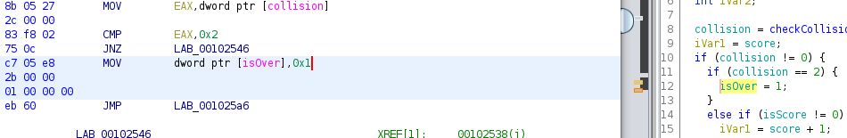
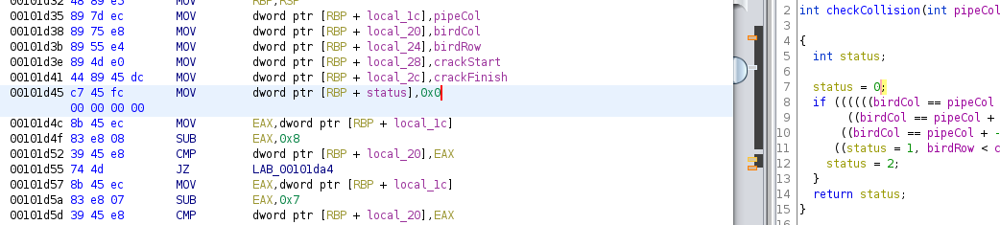
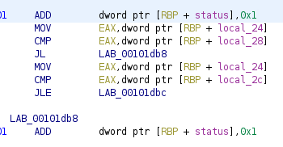
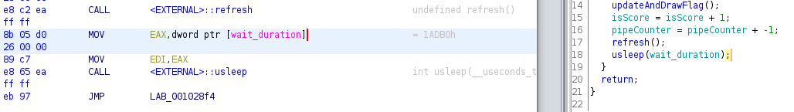

# flappy-o

## RE - 181 pts (61 Solves)

I know you cheated in flappy-js. This time the game is written in C, I don't think you can cheat so easily. Or can you?

Show me your skills by getting a score of at least 64.

> Hint: Consider [patching](https://www.youtube.com/watch?v=8U6JOQnOOkg).

Files: [flappybird](./flappy-o/flappybird)

# Solution

As instructed by the hint, we can patch the game to allow us to 'cheat' the game. Using [ghidra](https://www.kali.org/tools/ghidra/) we can reverse engineer the file.

In order to ensure the game does not result in a segmentation fault after patching, the file has to be imported into ghidra as `Raw Binary` instead of the default `Executable and Linking Format (ELF)`, and selecting the language it is in (`x86:LE:64:default:gcc`). However, in doing so, a lot of useful information such as function names and variable names are lost. Thus, we imported it both as `Raw Binary` and `ELF`, using the `ELF` version as a nice reference.

We find a few peculiar functions that may come in handy:

- `checkAndHandleCollision`
- `checkCollision`
- `processInput`
- `reportCheater`
- `updateAndDrawFlag`

## `checkAndHandleCollision`

Reading the function, we see the following:

```
...
collision = checkCollision(pipeCol1, birdCol, birdRow, crackStart1, crackFinish1);
iVar1 = score;
if (collision != 0) {
    if (collision == 2) {
        isOver = 1;
    }
    else if (isScore != 0) {
...
```

Clearly, we do not want the game to end, so we must ensure that `isOver` does not equal to `1`. One way of patching this is by patching the following command:



We can change `MOV dword ptr [isOver],0x1` to `MOV dword ptr [isOver],0x0` to simply render that check useless, such that the function will check:

```
...
if (collision != 0) {
    if (collision == 2) {
        isOver = 0;
    }
...
```

In this case, we will now require the `checkCollision` function to return a value other than 0 in order to proceed. Both 1 and 2 work here since we essentially skipped checking if it is 2. 

### Alternatively...

Alternatively, we can skip patching `checkAndHandleCollision` and just make `checkCollision` return 1 always.

## `checkCollision`

As discussed above, we want `checkCollision` to return 1 or 2, but preferably 1 (especially if you skipped patching `checkAndHandleCollision`). There are a bunch of if statements that will change the value of `status`, and the function then returns the value of `status`.

We can modify this function to only return 1:



1. Modify `MOV dword ptr [RBP + status],0x0` to `MOV dword ptr [RBP + status],0x1`, meaning we are setting the value of `status = 1` in the first line.



2. Here, we see 2 `ADD`s which will increase the value of `status` by 1. We can modify both of them, to be `0x0` instead of `0x1` to increase the value of `status` by 0, i.e. do nothing.

After making the above modifications, checkCollision will only return 1.

## `processInput`

We notice a `isOver = 1` in processInput, meaning that the game will check if the bird is below a certain value (the floor) and will end the game if it goes below it. Patching this is similar to `checkAndHandleCollision`, changing `MOV dword ptr [isOver],0x1` to `MOV dword ptr [isOver],0x0`.

## `reportCheater`

This function seems to automatically end the game if it detects some sort of cheating. Unfortunately we are unable to see under what conditions it will detect this cheating. Instead, we see where it is being called, and find an entry point under `updateAndDrawFlag`.

## `updateAndDrawFlag`

It looks like here is where the scores are being processed in order for the game to draw the flag, and we also notice that `reportCheater` is also called here, if the difference between the previous score and the current score is not 1. We could modify these instructions and skip the `reportCheater` call, while giving ourselves a lot more score increment, however...

## `gameLoop`

We can just change the `usleep` duration to be 1 or even 0 just to make the game go fast brrrr



Change `MOV EAX,dword ptr [wait_duration]` into `MOV EAX,0x1` to turn it into `usleep(1)`. You can try `usleep(0)`, which will be faster, but also more seizure-inducing.

## Output and Run

Once we have patched the above, we can export the newly patched file as a binary and just let it run! With no collision checking we can just let the game run on its own, and on `usleep(1)` it should take almost no time for the game to print out the first flag.

# Flag

`grey{y0u_4r3_pr0_4t_7h1s_g4m3_b6d8745a1cc8d51effb86690bf4b27c9}` 