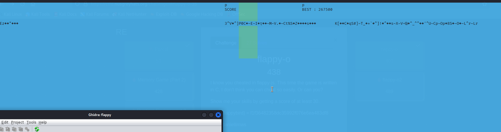

# flappy-o2

## RE - 388 pts (36 Solves)

This challenge uses the same binary as [flappy-o](./flappy-o.md).

Every 10000 points you reach, you unlock a character of the bonus flag. This is the real test of your skills.

Files: [flappybird](./flappy-o/flappybird)

# Solution

1. Follow the instructions as listed in [flappy-o](./flappy-o.md). It might be more helpful to use `usleep(0)` here.
2. Now wait. It shouldn't take too long to reach `250,000`, perhaps around 1.5 hours.

## Sidenote

We did try to increase the score interval (changed from 1 to 125), which also required skipping the `reportCheater` check. However, doing so caused the game to output garbled characters.

Turns out messing with the score interval will mess with the `genFlag2` function as well. Not worth the hassle, just let it run by incrementing by 1.

# Flag

`grey{y0u_4r3_v3ry_g00d_4t_7h1s_g4m3_c4n_y0u_t34ch_m3_h0w_t0_b3_g00d_ef4bd282d7a2ab1ebdcc3616dbe7afb}`